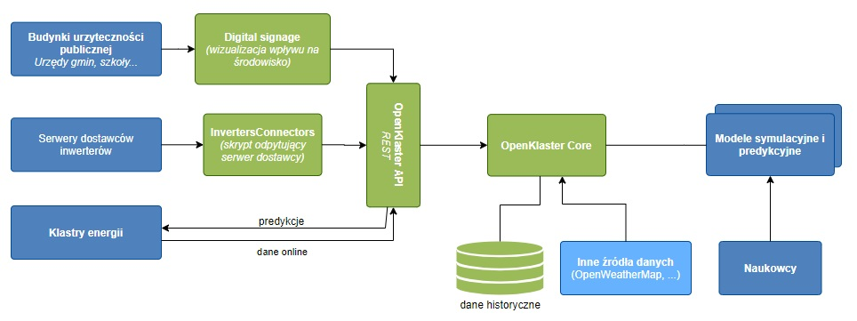

# OpenKlaster
## Table of contents
* [General info](#general-info)
* [System architecture](#system-architecture)
* [Technologies](#technologies)
* [Setup](#setup)
* [Deployment](#Deployment)
* [Features](#features)
* [Screenshots](#screenshots)

## General info
Recent years have seen a significant increase in interest in renewable energy. In Poland, every year we break new records for the capacity of installed photovoltaic installations. In order to further popularize the topic of renewable energy sources, more and more knowledge about their production will be necessary. A platform that makes this possible may turn out to be a big step forward.

OpenKlaster is a web service providing predictive and simulation data on energy obtained from renewable sources. The service provides data via API,
enabling integration with IT systems of energy producers and in a graphic form enabling their visualization in public spaces. It also allows you to manage installations for which data is downloaded, stored and analyzed. The information provided by the service is based on measurement data provided by renewable energy producers and obtained from other sources, such as numerical forecasts
weather. The service is targeted at two main groups of recipients - energy clusters and public utility buildings and aims to:
* energy clusters - increasing the quality of energy distribution management based on predictive data calculated on the basis of historical and current energy production,
* public utility buildings using renewable energy - increasing the awareness of residents and users about the benefits of using renewable energy by presenting statistical data in public spaces (e.g. offices, schools).
	
The service is built in a microservice architecture and essentially consists of several components:
* OpenKlasterCore - the main module responsible for the logic of service operation and interactions with the database
* OpenKlasterAPI - module responsible for API exposure
* simulation / predictive models - modules responsible for providing predictive data based on data sent by end recipients, historical data and other data sources
* DigitalSignage - the module responsible for the visualization of data provided by the OpenKlaster service. Its main purpose is to present, mainly in graphic form, the profits from the use of renewable energy. The module works on the end user side and is the API client of the service.

In the basic version of the service, two models of data analysis concerning the amount of renewable energy are assumed:
* predictive model - short-term prediction based on the prediction of the time series representing the amount of generated energy and the long-term one based on the numerical long-term weather forecast (for PV panels),
* simple simulation model - determining the level of reduction of harmful effects on the natural environment, mainly by limiting the emission of harmful substances for
## Technologies

	
## Setup
To run this project it is required to have Docker and Maven that will be used to compile the code. To boot the system you first need to use the mvn package method in main project folder, compile the project into jar files.
```
mvn clean package -U -DskipTests
```
Then use the resulting artifacts to create containers, where each service is a separate container. Additionally, OpenKlasterWeb, databases, a page in Grav CMS and the scripts in InvertersConnectors have their own components. The configuration is in the docker-compose.yml file, in addition, each Vert.x and OpenKlasterWeb service has its own Docker file used to build specific containers.
```
docker-compose up
```
## Deployment
Preparation and launch of the system in the production environment on the Oracle Linux 8 machine.

Enable all required repositories. To do this, we need the package
"yum-utils".
```
dnf install -y dnf-utils zip unzip
dnf config-manager –add-repo=https://download.docker.com/linux/centos/dockerce.repo
```
Docker installation.
```
dnf install -y docker-ce –nobest
```
Enabling and starting the Docker service.
```
systemctl enable docker.service
systemctl start docker.service
```
We can get information about Docker using the following commands
```
systemctl status docker.service
docker info
docker version
```
Now we need to install the "curl" package.
```
sudo dnf -y install curl
```
After installing curl we download the latest version of Compose.
```
curl -s https://api.github.com/repos/docker/compose/releases/latest
| grep browser_download_url
| grep docker-compose-Linux-x86_64
| cut -d ’” -f 4
| wget -qi
```
We're changing the permissions to make the binary executable
```
chmod +x docker-compose-Linux-x86_64
```
We move the file to the PATH path.
```
sudo mv docker-compose-Linux-x86_64 /usr/local/bin/docker-compose
```
We can get the Docker Compose version information
```
docker-compose version
```
To start the system, first clone the necessary files from the repository
```
git clone https://github.com/Mervolt/OpenKlaster.git
```
It remains for us to run the system with the appropriate settings for the production environment
one.
```
docker-compose -f docker-compose.yml -f production.yml up
```
## Features
* Registration, logging in, generating and removing tokens
* Installation management
* Automated collecting of measurements from the installation
* Environmental benefits
* Visualizations that can be run on a Raspberry Pi or directly from the website (Digital Signage)
* Prepared environment for displaying graphs related to energy production prediction
* API documentation
* Welcome page presenting the system
##### To do:
* Processing and analysis of the energy cluster data
* Analysis of satellite images for the assessment of solar irradiation
* Weather forecast analysis for solar irradiation prediction
## Screenshots
Todo
